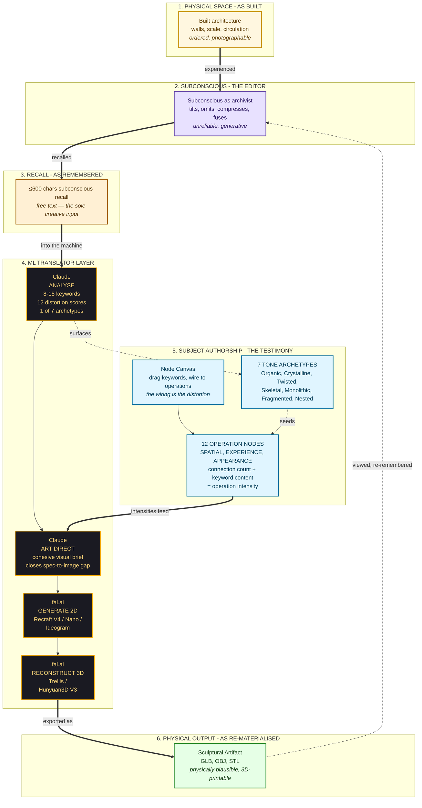
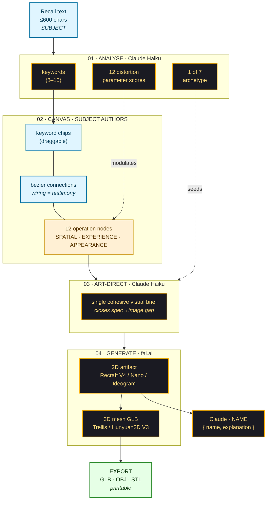

# Concept Diagram — Glitch as Meaningful Distortion of Spatial Memory

> Glitch is not aesthetic — it is how the subconscious edits architecture.
> The Interactive Memory Machine externalises that editing as a structured, authored, printable transformation.

The diagram below traces the conceptual frame: a built space passes through the subject's subconscious, returns as recalled (and distorted) memory, is decomposed into a structured spec by ML, re-authored on the node canvas by the subject, and returns to physical form as a 3D-printable sculptural artifact.

## Concept Map

---

## Reading the diagram

**Three loops, not one pipeline.**
The arrows form three nested loops — and the project lives in the third.

1. **The *built* loop** (bottom — implicit): A space is constructed, experienced, photographed. This is the conventional architectural record. IMM has no interest in this loop on its own.
2. **The *memory* loop** (orange → purple → orange): Built space is experienced, edited by the subconscious, recalled — usually into language, sometimes into a sketch. This is the loop that architectural memory studies, oral history, and trauma-of-place research already examine without ML.
3. **The *re-materialised* loop** (purple → black → blue → green → dotted-back-to-purple): IMM enters here. The recalled text is decomposed by Claude into structured parameters; the subject re-authors the distortion on the canvas; an art-director Claude pass closes the spec-to-image gap; fal.ai synthesises a 2D image and lifts it into a printable mesh. The artifact, once held, can re-enter the subject's memory and shift the next recall — a feedback the dotted loopback represents.

**The art director is the keystone.**
Without the art director, text-to-image models treat parameter scores as token noise. With it, the same scores become architectural intent. This is why DIRECT sits between the spec layer (ANALYSE + canvas wiring) and the generative layer (IMG → MESH).

**Authorship lives on the canvas.**
The same recall, with different wirings, produces different artifacts. The canvas is what makes the distortion the *subject's* distortion rather than the model's average.

**The archetype seeds, the operations deform.**
Of the seven archetypes, exactly one is selected per recall (Claude classifies). It seeds the base shape language. The twelve operations then deform that base. Multiple keywords on a single node = stronger pull on that operation.

---

## Concept loop in one sentence

> A built space → bent by the subconscious → spoken as text → decomposed into 12 distortion parameters → re-authored on a canvas by the subject → re-materialised as a printable sculpture → held in the hand → which alters the next recall.

---

## Detailed concept diagram — Authorship inside the ML translator

This second view zooms into the ML translator layer. It makes three choices visible:

- **The subject acts twice** — once as recall author (input), once as wiring author (canvas). The wiring is the part that carries forward subject authorship into the model output.
- **The archetype short-circuits to the art director.** It never modifies the canvas wiring; it only affects how the brief is *written*.
- **Naming is a separate Claude call** — the artifact name is editable by the subject, drives 3D export filenames, but is otherwise downstream of the image generation.

---

*Render this diagram as PNG/SVG by pasting the `mermaid` code block into [mermaid.live](https://mermaid.live), or run `npx -y @mermaid-js/mermaid-cli -i concept_diagram.md -o concept_diagram.png` from the deliverables/diagrams folder.*
