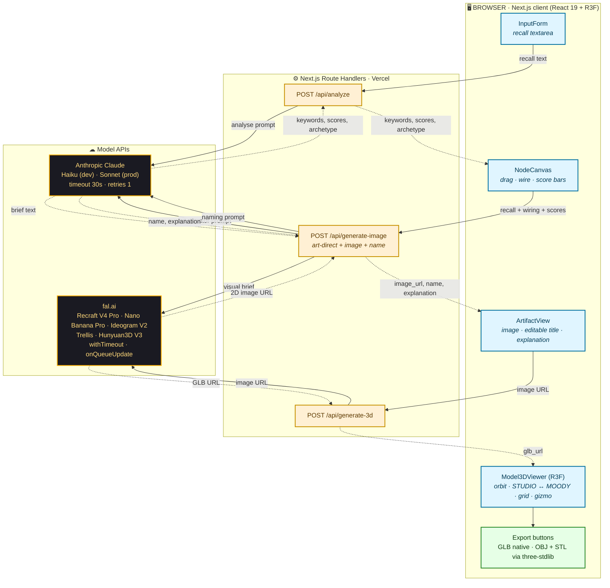
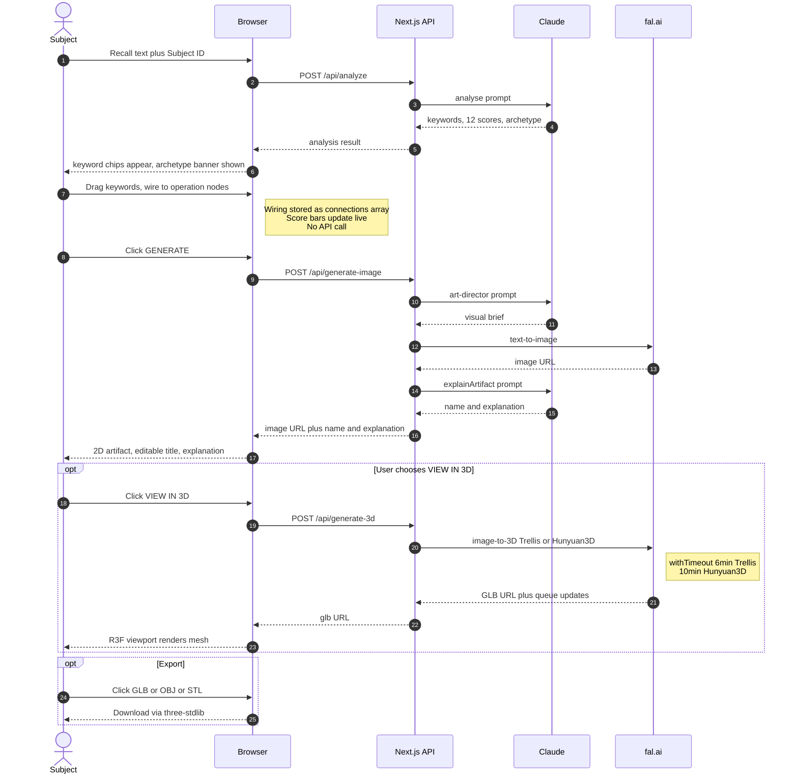

# Workflow Diagram — IMM 10-Stage Pipeline

> Ten stages from recalled text to exported mesh.
> Amber = ML inference (Claude / fal.ai). Blue = subject action. Green = artefact / output.

---

## Linear pipeline

```mermaid
flowchart LR
    S01["01 · INPUT<br/><i>recall text ≤600 chars</i>"]:::user
    S02["02 · ANALYSE<br/>Claude<br/>keywords · 12 scores · archetype"]:::model
    S03["03 · CANVAS<br/><i>wire keywords → operations</i>"]:::user
    S04["04 · DIRECT<br/>Claude<br/>mechanical → visual brief"]:::model
    S05["05 · GENERATE<br/>fal.ai<br/>Recraft V4 / Nano / Ideogram"]:::model
    S06["06 · NAME<br/>Claude<br/>{ name, explanation }"]:::model
    S07["07 · VIEW 2D<br/><i>image + title + interpretation</i>"]:::user
    S08["08 · RECONSTRUCT<br/>fal.ai<br/>Trellis / Hunyuan3D V3"]:::model
    S09["09 · ORBIT<br/><i>R3F · STUDIO ↔ MOODY</i>"]:::user
    S10["10 · EXPORT<br/>GLB · OBJ · STL<br/><i>three-stdlib client-side</i>"]:::out

    S01 --> S02 --> S03 --> S04 --> S05 --> S06 --> S07 --> S08 --> S09 --> S10

    classDef user  fill:#e0f5ff,stroke:#0070a0,color:#003a55,stroke-width:2px
    classDef model fill:#1a1a22,stroke:#ffb000,color:#ffd87a,stroke-width:2px
    classDef out   fill:#e6ffe6,stroke:#2a8a2a,color:#103a10,stroke-width:2px
```

---

## Architecture & request flow

This view groups the 10 stages by the layer they execute on (browser, Next.js API route, third-party model API) and shows the artefacts that pass between them.

---

## State sequence

This view shows what data exists at each stage of the pipeline and what survives between stages.

---

## Failure-mode legend (resilience hardening)

| Failure | Mitigation |
|---------|------------|
| Anthropic 429/529 transient | `timeout: 30_000`, `maxRetries: 1` — fail fast, surface to UI |
| fal Trellis hung > 6 min | `withTimeout(6*60_000)` aborts |
| fal Hunyuan3D hung > 10 min | `withTimeout(10*60_000)` aborts |
| WebGL context lost (long session) | `webglcontextlost` listener auto-remounts Canvas with new key (300 ms debounce) |
| R3F transient `[object Event]` errors | `ViewerErrorBoundary` swallows + logs |
| GPU paint thrash | LED pulses animate `opacity` only, no `box-shadow` |

---

*Render any of the three diagrams as PNG/SVG by pasting their `mermaid` code block into [mermaid.live](https://mermaid.live), or run `npx -y @mermaid-js/mermaid-cli -i workflow_diagram.md -o workflow_diagram.png` from the deliverables/diagrams folder.*
